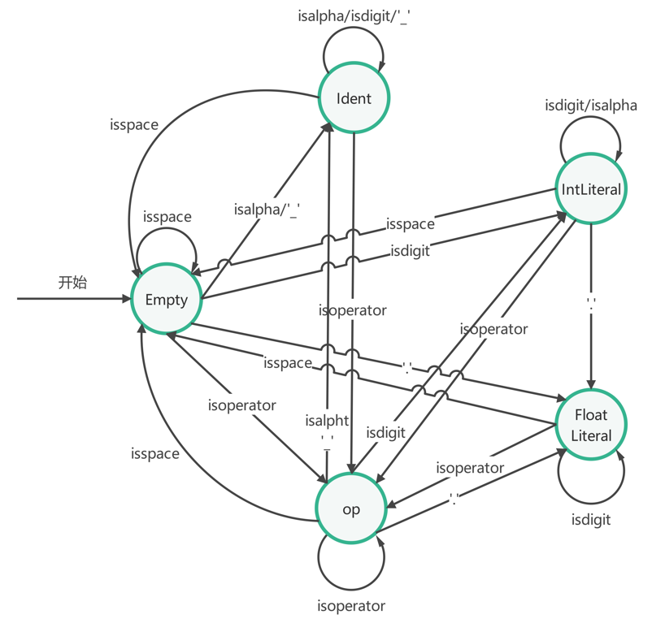
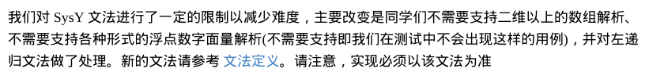
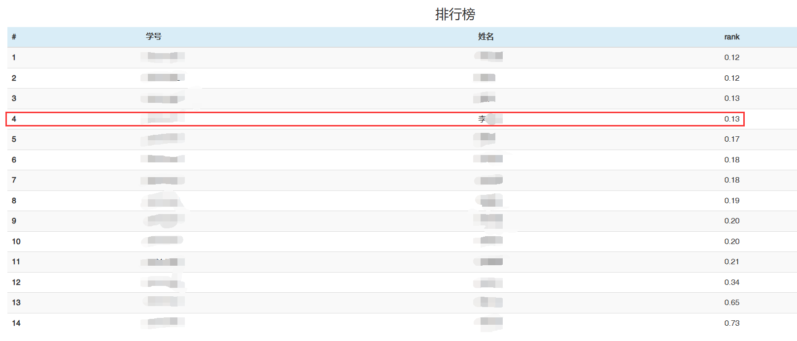

<h1><center>重庆大学编译原理课程实验</center></h1>

## 一、实验目的

以系统能力提升为目标，通过实验逐步构建一个将类C语言翻译至汇编的编译器，最终生成的汇编代码通过GCC的汇编器转化为二进制可执行文件，并在物理机或模拟器上运行。帮助掌握编译原理的各个环节：词法分析、语法分析、语义分析、代码生成，以及实现所需的数据结构：语法树、符号表等。通过这样的实验，提高学生协作编程的能力，加深对编译技术的理解，编译原理是一门综合各个学科知识的课程，编译系统设计让学生在实践中综合理解计算机学科知识。


## 二、实验方案

本次实验将实现一个由SysY(精简版C语言，来自[CSC / CSC-Compiler / Compiler2022 · GitLab (eduxiji.net)](https://gitlab.eduxiji.net/csc1/nscscc/compiler2022/-/tree/master))翻译至RISC-V汇编的编译器，生成的汇编通过GCC的汇编器翻译至二进制，最终运行在模拟器qemu-riscv上实验至少包含四个部分:词法和语法分析、语义分析和中间代码生成、以及目标代码生成，每个部分都依赖前一个部分的结果，逐步构建一个完整编译器。

1. 实验一：词法分析和语法分析，将读取源文件中代码并进行分析，输出一颗语法树。
2. 实验二：接受一颗语法树，进行语义分析、中间代码生成，输出中间表示IR(Intermediate Representation)
3. 实验三：根据IR翻译成为汇编
4. 实验四(可选)：IR和汇编层面的优化


## 三、实验环境搭建

实验开始的第一步便是搭建实验环境，一个好的实验环境可以让你事半功倍，但是可惜的是实验指导书提供的内容大概率是远远不够的，所以还需要大家自行摸索。这里我仅展示我配置环境的过程，对于一些细节和更多功能还需要同学们STFW(Search The Fucking Web)。

### 3.1 下载实验框架

[重庆大学在希冀平台上的项目](https://course.educg.net/indexcs/simple.jsp?loginErr=0)一共提供了三个版本的实验框架，这里建议直接下载实验3或者实验4的代码框架，实验1和实验2的框架都只包含自己实验需要的部分，不包括后面的内容。这样可以一直延续使用，不用中途更换代码。

>  [!warning]  
>
> 实验2的代码框架存在问题，如果是通过docker配置的运行环境，那么会出现Cmake版本不匹配的问题，这里需要修改CMakeLists.txt文件的第一行代码为：`cmake_minimum_required(VERSION 3.10)`。docker环境中和其他代码框架提供的版本都是3.10版本，而实验2代码框架是3.22版本。


### 3.2 准备Linux环境

这里不建议配置Windows实验环境，因为后面的qemu只能在Linux环境下运行。有两种方式可以配置Linux环境，一种是通过VMware虚拟机，另一种是通过WSL(Windows Subsystem for Linux)。这里建议选择后者，原因有两点，第一个原因是性能更好，在代码量比较大的情况下，可能打开Vscode阅读代码都会出现卡顿，使用WSL可以显著提升性能，因为它是直接运行在硬件上。第二个原因是可以更方便地通过远程连接Vscode，这样就可以更加方便地配置调试环境。

具体的配置方法这里不做具体讲解，因为你大概率会遇到自己的问题，所以这里仅仅给出一些步骤，具体的操作还是请STFW。

1. 开启Windows系统的Linux子系统功能和虚拟机平台功能。
2. 安装WSL，可以升级到WSL2，据说性能更好。
3. 在WSL中安装Ubuntu22.04系统。


### 3.3 准备docker环境

完成3.2后你已经获得了自己的Linux系统，下面需要连接到Vscode。首先在Vscode中安装WSL插件，然后点击右下角的那个双箭头就可以连接到WSL。连接好后你就可以通过Vscode的终端直接操作Linux系统，而且之后也可以直接通过Vscode打开WSL，而不再需要通过Windows的命令行或者终端。

为了获得实验环境还需要下载docker，docker的下载安装方法也请STFW。这里也可能会遇到很多问题，自己摸索吧，不遇到问题怎么知道自己在配置环境呢。

安装好docker后就需要拉取实验环境的镜像：

```dockerfile
docker pull frankd35/demo:v3
```

哦，对了，第一步其实是启动docker：

```bash
sudo service docker start
```

拉取镜像的意思其实和下载Windows或者Linux操作系统的安装包差不多，只不过这个安装包里面已经帮你配好了适配于我们实验框架的环境，通过挂载就可以使用。

然后就是挂载目录：

```dockerfile
docker run -it -v {你的代码框架目录}:/coursegrader frankd35/demo:v3
```

挂载目录其实也有前置步骤，你首先需要把已经下载好的代码框架复制到Linux系统中，如果你使用的是WSL，那么可以通过`cp`指令复制压缩包。至于为什么可以直接通过`cp`指令复制，这是因为WSL会自动将我们的硬盘挂载到`/mnt`目录下，这样就可以直接访问Windows目录下的文件。然后在自己需要的目录下解压代码框架就可以了，解压的目录就对应上面那条指令里面的“你的代码框架目录”。

完成这一步后就创建了一个docker容器，如果你在Vscode安装了docker的插件那么在你的右边菜单栏里面应该可以看到一个鲸鱼标志，点击标志可以通过Vscode提供的图形化界面来使用docker。如果点击后显示×，那么说明你的docker没有启动。

进入过后应该有三栏，第一栏是CONTAINERS，也就是容器，就是我们前面挂载目录所创建的东西。第二栏是IMAGES，也就是镜像，是我们拉取的实验环境。第三栏没用到，不用管。刚进入docker后如果容器显示的是一个橙红色的方框，说明容器没有启动，可以右键这个容器选择Start，然后记得刷新。启动后容器会变成绿色的箭头，然后再次右键，这里建议选择附加Vscode，这样才可以继续配置gdb并连接到Vscode。一个镜像可以通过挂载不同的目录创建多个不同的容器，这样就可以同时运行多个代码。

> [!tip]
>
> 以下是给粥粥人MuMu模拟器用户的一些建议。在你开启WSL之后有没有发现每次进入模拟器开始在98%卡住并且玩舟的时候也开始卡顿了？或者说如果你通过模拟器关闭Hyper-V后WSL用不了了？
>
> 不用担心，这些都是正常现象，都是Windows不够努力导致的。Windows提供的Hyper-V会和模拟器的虚拟机冲突，正所谓鱼和熊掌不可兼得，如果你希望模拟器不卡顿，那就点击你的模拟器的菜单栏，打开问题诊断进行优化，模拟器会自动为你关闭Hyper-V。哈哈，然后你就会发现你的WSL用不了了。
>
> 不过也别急，如果你想要重新打开WSL也很简单，第一步以管理员身份运行终端，执行以下命令：`bcdedit /set hypervisorlaunchtype auto`；第二步就是通过Windows->搜索“启用或关闭Windows功能”->开启Hyper-V。如果没有这一项，还需要通过批处理加入这一项。批处理的指令就自己上网搜索吧。
>
> 你问我为什么一个tips写的和正文差不多，那当然是因为粥粥人心疼粥粥人😋。


### 3.4 编译项目

进行到这一步终于可以开始编译项目了，第一步是修改CMakeLists.txt文件中的几个小bug。在文件中找一个位置添加以下两行代码：

```cmake
set(CMAKE_C_COMPILER "/usr/bin/x86_64-linux-gnu-gcc-7")
set(CMAKE_CXX_COMPILER "/usr/bin/x86_64-linux-gnu-g++-7")
```

这两行代码的作用是指定C和C++编译器的路径和版本。

第二步是在`/coursegrader`目录下创建一个`build`文件夹，然后进入`build`文件夹，依次执行以下命令：

```bash
cmake ..
make
```

这样就可以完成项目的编译，编译的结果是在`/coursegrader/bin`目录下生成一个名为`compiler`的可执行文件和一些其它的中间文件。

#### 3.4.1 单点测试

单点测试需要输入对应的参数执行`compiler`程序。程序会根据我们输入参数的不同执行不同的功能，对参数的解析过程在`main.cpp`文件中，可以自己研究一下。这里给出一个示例，比如我要执行`00_main.sy`测试点的riscv汇编代码生成功能：

```bash
./bin/compiler ./test/testcase/basic/00_main.sy -S -o ./myTest/test.out
```

第一个参数`./bin/compiler`是程序的路径，第二个`./test/testcase/basic/00_main.sy`是输入的文件路径，第三个`-S`是执行的阶段，第四个`-o`是输出文件选项，第五个`./myTest/test.out`是输出文件的路径和文件名。

这里再提供一个我的常用的快速指令吧，可以完成编译->单点测试的全过程：

```bash
cd /coursegrader
rm -rf build/
mkdir build
cd ./build
cmake ..
make
cd /coursegrader
./bin/compiler ./test/testcase/basic/00_main.sy S -o ./myTest/test.out
```

其实也可以把这些代码写成一个脚本，不过我不会，有兴趣可以自己探索一下。

> 2024年8月22日补档
> 好，时隔几个月，我又回来了，我现在已经会脚本了，首先执行touch name.sh创建一个脚本文件。然后把上面几句话全部粘贴进来，之后sudo chmod +x name.sh赋予脚本执行权限。最后./name.sh就可以执行脚本了。


#### 3.4.2 集中测试

除了上一小节提供的单点测试的方法，框架中还提供了python脚本来进行集中测试，测试的脚本在`test`目录下。可以依次执行以下命令来进行测试：

```bash
cd /coursegrader/test
python3 build.py
python3 run.py s0
python3 test.py s0
```

> [!note]
>
> python脚本在输入功能参数的时候和单点测试有一点区别，单点测试的时候需要添加"-"，而功能测试不需要添加，这是因为在脚本中写了代码自动添加"-"。
>
> ~~我不理解，为什么不能设计成统一的方式，非要加些代码来实现自动加"-"，这不是吃力不讨好吗？~~


### 3.5 配置调试环境

不知道大家之前是怎么debug的，是用IDE提供的debug功能还是cout大法。如果是cout大法的话只能在单点测试使用，类似于IDE的debug方法需要配置调试环境。

#### 3.5.1 cout大法

如果你希望使用cout大法，可以选择导入头文件`iostream`，或者按照实验指导书中提供的方法，打开CMakeLists.txt文件中关于调试标志的注释，然后在代码中适当的位置添加头文件并加入cout语句。

> [!note]
>
> 这种方法其实是大型项目比较常用的一种方法，通过宏定义包裹调试信息输出语句，可以做到在非调试情况下不输出调试信息，优化程序的性能。下面是一些使用宏定义的示例：
>
> ```c++
> #ifdef DEBUG_DFA
>     printf("Debug DFA: Some debug information\n");
> #endif
> 
> #ifdef DEBUG_SCANNER
>     printf("Debug Scanner: Some debug information\n");
> #endif
> 
> #ifdef DEBUG_PARSER
>     printf("Debug Parser: Some debug information\n");
> #endif
> ```


#### 3.5.2 gdb调试

如果你希望能够使用断点调试或者监视程序运行过程中的变量，那么只能配置gdb调试环境。gdb的使用方法还请RTFM+STFW。不过如果是在终端使用gdb感觉还是不够方便，所以这里提供一些方法把gdb连接到vscode，这样使用gdb就和在IDE中使用debug功能差不多了。

首先请确保你的vscode直接连接到了容器，而不是wsl。检查的方法很简单，看vscode左下角有没有容器两个字。然后在你的项目目录下添加一个名为`.vscode`的文件夹，文件夹中创建两个文件，分别名为`tasks.json`和`launch.json`，前者是用于指导项目编译的，后者是用于指导debug工具连接的。

在`tasks.json`文件中输入以下内容：

```json
{
    "version": "2.0.0",
    "tasks": [
        {
            "label": "build",
            "type": "shell",
            "command": "cd ${workspaceFolder} && rm -rf build/ && mkdir build && cd ./build && cmake .. && make && cd ${workspaceFolder}",
            "group": {
                "kind": "build",
                "isDefault": true
            },
            "problemMatcher": [
                "$gcc"
            ],
            "detail": "编译 /coursegrader 项目"
        }
    ]
}
```

在`launch.json`文件夹中输入以下内容：

```json
{
    "version": "0.2.0",
    "configurations": [
        {
            "name": "Debug Compiler",
            "type": "cppdbg",
            "request": "launch",
            "program": "${workspaceFolder}/bin/compiler",
            "args": [
                // "./test/testcase/basic/00_main.sy",
                // "./test/testcase/basic/01_var_defn2.sy",
                // "./test/testcase/basic/02_var_defn3.sy",
                // "./test/testcase/basic/03_arr_defn2.sy",
                // "./test/testcase/basic/04_arr_defn3.sy",
                // "./test/testcase/basic/06_const_var_defn2.sy",
                // "./test/testcase/basic/07_const_var_defn3.sy",
                // "./test/testcase/basic/08_const_array_defn.sy",
                // "./test/testcase/basic/09_func_defn.sy",
                // "./test/testcase/basic/10_var_defn_func.sy",
                // "./test/testcase/basic/11_add2.sy",
                // "./test/testcase/basic/12_addc.sy",
                // "./test/testcase/basic/13_sub2.sy",
                // "./test/testcase/basic/14_subc.sy",
                // "./test/testcase/basic/15_mul.sy",
                // "./test/testcase/basic/16_mulc.sy",
                // "./test/testcase/basic/17_div.sy",
                // "./test/testcase/basic/18_divc.sy",
                // "./test/testcase/basic/20_rem.sy",
                // "./test/testcase/basic/21_if_test2.sy",
                // "./test/testcase/basic/22_if_test3.sy",
                // "./test/testcase/basic/23_if_test4.sy",
                // "./test/testcase/basic/25_while_if.sy",
                // "./test/testcase/basic/26_while_test1.sy",
                // "./test/testcase/basic/27_while_test2.sy",
                // "./test/testcase/basic/29_break.sy",
                // "./test/testcase/basic/30_continue.sy",
                // "./test/testcase/basic/31_while_if_test1.sy",
                // "./test/testcase/basic/32_while_if_test2.sy",
                // "./test/testcase/basic/33_while_if_test3.sy",
                // "./test/testcase/basic/35_op_priority1.sy",
                // "./test/testcase/basic/36_op_priority2.sy",
                // "./test/testcase/basic/37_op_priority3.sy",
                // "./test/testcase/basic/40_unary_op.sy",
                // "./test/testcase/basic/41_unary_op2.sy",
                // "./test/testcase/basic/42_empty_stmt.sy",
                // "./test/testcase/basic/45_comment1.sy",
                // "./test/testcase/function/28_while_test3.sy",
                // "./test/testcase/function/34_arr_expr_len.sy",
                // "./test/testcase/function/38_op_priority4.sy",
                // "./test/testcase/function/39_op_priority5.sy",
                // "./test/testcase/function/43_logi_assign.sy",
                // "./test/testcase/function/47_hex_oct_add.sy",
                // "./test/testcase/function/48_assign_complex_expr.sy",
                // "./test/testcase/function/49_if_complex_expr.sy",
                // "./test/testcase/function/50_short_circuit.sy",
                // "./test/testcase/function/51_short_circuit3.sy",
                // "./test/testcase/function/52_scope.sy",
                // "./test/testcase/function/55_sort_test1.sy",
                // "./test/testcase/function/62_percolation.sy",
                // "./test/testcase/function/64_calculator.sy",
                // "./test/testcase/function/66_exgcd.sy",
                // "./test/testcase/function/70_dijkstra.sy",
                // "./test/testcase/function/73_int_io.sy",
                // "./test/testcase/function/78_side_effect.sy",
                // "./test/testcase/function/79_var_name.sy",
                // "./test/testcase/function/89_many_globals.sy",
                "./test/testcase/function/95_float.sy",
                // "-e",
                // "-s2",
                // "-o",
                // "./myTest/test.ir",
                "-S",
                "-o",
                "./myTest/test.s"
            ],
            "stopAtEntry": false,
            "cwd": "${workspaceFolder}",
            "environment": [],
            "externalConsole": false,
            "MIMode": "gdb",
            "setupCommands": [
                {
                    "description": "Enable pretty-printing for gdb",
                    "text": "-enable-pretty-printing",
                    "ignoreFailures": true
                }
            ],
            "miDebuggerPath": "/usr/bin/gdb",
            "preLaunchTask": "build",
            "logging": {
                "engineLogging": true
            }
        }
    ]
}
```

> [!warning]
>
> 这里还需要修改一下CMakeLists.txt文件中的一点bug，原始的错误语句如下：
>
> ```cmake
> set(CMAKE_CXX_FLAGS   "-g")                     # 调试信息
> set(CMAKE_CXX_FLAGS   "-Wall")                  # 开启所有警告
> ```
>
> 这种写法是有问题的，如果你希望同时开启调试信息和警告信息，需要按照如下写法：
>
> ```cmake
> set(CMAKE_CXX_FLAGS "${CMAKE_CXX_FLAGS} -g -Wall")  # 调试信息和所有警告
> ```
>
> 如果按照第一种写法是不会生成调试信息的，也就不能启用gdb调试。

> [!note]
>
> 所谓的调试信息其实就是符号表和一些其他的信息，我们现在也是在编写一个编译器，如果你写完了实验三，那么你会明白我们的符号表的信息其实是没有出现在汇编代码中的。开启`-g`这个选项，实际上就是在生成汇编代码的时候，加入一些标识符，告知gdb一些变量的信息和栈信息。然后在运行的时候就能匹配这些信息，从而得知原始的变量名并且呈现出来。

最后使用F5快捷键就可以开启调试了，具体的调试方法我就不介绍了，自己STFW吧。

> [!tip]
>
> 这里还建议大家尝试使用一下doxygen注释，这个注释在你的鼠标悬停在某一函数或者某一变量上时是可以显示出来的，这样可以提醒你函数或者变量的功能。我的代码中就按照这样的方法添加的注释，具体怎么配置可以自己STFW。


## 四、实验框架目录说明

```
coursegrader
├─ .gitignore # git上传忽视文件列表
├─ .vscode # gdb调试配置文件
│    ├─ c_cpp_properties.json
│    ├─ launch.json
│    ├─ settings.json
│    └─ tasks.json
├─ CMakeLists.txt # CMake配置文件
├─ RAEDME.assets # README图像资源
├─ README.md # 项目说明文件
├─ bin # 编译生成的二进制文件
│    ├─ compiler # 目标文件
│    ├─ libBackend.a
│    ├─ libFront.a
│    ├─ libIR.a
│    ├─ libTools.a
│    └─ libjsoncpp.a
├─ build # CMake构建目录，需自己创建
├─ docs # 相关资料
│    ├─ RISC-V手册(中文版).pdf # 浮点数的舍入模式看这个
│    ├─ RISC-V手册(英文版).pdf
│    ├─ RISC-V指令(简略版).pdf # 一般riscv汇编需要看这个
│    ├─ SysY语言定义-V1.pdf # 实验一多看看这个
│    ├─ readme.txt # 框架里面的项目编译方法
│    ├─ riscv-abi.pdf
│    ├─ riscv-asm.md # 对riscv伪代码的说明，有帮助
│    ├─ riscv-spec-v2.2.pdf
│    ├─ riscv-spec.pdf
│    ├─ unpriv-isa-asciidoc_20240411.pdf
│    ├─ 希冀系统学生使用讲解.pptx
│    ├─ 文法树.xmind # 编写实验一的时候可以看看，我自己画的，不然记不住
│    ├─ 状态转移图.eddx # 实验一词法分析的DFA图
│    ├─ 状态转移图.jpg
│    └─ 编译原理实验指导书.pdf
├─ include # 头文件目录，结构和源文件目录差不多
├─ lib # 静态链接库，如果要用静态连接文件记得重命名
│    ├─ libIR-x86-linux.a
│    ├─ libIR-x86-win.a
│    ├─ libIR.a
│    ├─ libTools-x86-linux.a
│    ├─ libTools-x86-win.a
│    └─ libTools.a
├─ main.cpp # 主程序，对于参数的解析看这里
├─ myTest # 我自己创建的单点测试的目录
│    ├─ sylib-riscv-linux.a
│    ├─ test.ir
│    ├─ test.out
│    ├─ test.s
│    ├─ testref.c
│    ├─ testref.out
│    └─ testref.s
├─ src # 源文件目录
│    ├─ backend # 后端
│    │    ├─ generator.cpp # 目标代码生成器
│    │    └─ rv_def.cpp # riscv汇编相关定义
│    ├─ front # 前端
│    │    ├─ abstract_syntax_tree.cpp # 抽象语法树定义
│    │    ├─ lexical.cpp # 词法分析器实现
│    │    ├─ semantic.cpp # 语义分析器实现
│    │    ├─ syntax.cpp # 语法分析器实现
│    │    └─ token.cpp # 词法单元定义
│    ├─ ir # IR相关定义
│    │    ├─ ir_function.cpp
│    │    ├─ ir_instruction.cpp
│    │    ├─ ir_operand.cpp
│    │    ├─ ir_operator.cpp
│    │    ├─ ir_program.cpp
│    │    └─ type.cpp
│    ├─ third_party # 第三方库，生成json对象用的
│    └─ tools
│           ├─ ir_executor.cpp # ir评测机实现
│           └─ sylib.c # 运行时库实现
└─ test
       ├─ __pycache__ # python创建的临时文件
       ├─ build.py # 自动构建脚本
       ├─ log.txt # 脚本报错信息
       ├─ output # 脚本运行结果
       ├─ ref # 参考运行结果
       ├─ run.py # 执行脚本
       ├─ score.py # 评分脚本
       ├─ sylib-riscv-linux.a
       ├─ sylib.h # 运行时库头文件
       ├─ test.py # 其实就是前三个脚本的合集，会自动调用前三个脚本，一条龙服务
       └─ testcase # 测试点源文件
```


##  五、实验一

实验一包含两个部分，词法分析和语法分析。

### 5.1 词法分析

词法分析的输入是源程序，输出是token串。主要的工作可以分为两个部分，一是预处理器，用于删除注释；二是DFA有限状态机，通过状态转换来输出对应的token串。

预处理器的工作原理主要是通过逐行读取文件输入流来删除注释。需要处理的注释分为两种类型。

- 第一种是单行注释，比较简单，格式如下：`// ...`，如果在一行中查找到两个连续的`//`，那么就可以认为是单行注释的起点，连带这两个字符及本行后面的内容都删除即可；
- 第二种是多行注释，需要创建一个布尔型的变量`isInMulCom`来辅助进行处理，这个变量主要用于记录当前是否存在于多行注释内部，多行注释的格式如下`/* ... */`，需要通过查找`/*`来确定多行注释的起点。如果本行有多行注释起点，那么就先在本行查找`*/`，如果存在，连带多行注释起始符内的所有内容都需要删除；如果不存在，那么就将变量置1，标记当前处于多行注释内部，然后删除本行多行注释起点后的所有内容，并继续处理下一行，处理下一行时直接查找多行注释结束符，如果不存在，删除这一行，否则删除这一行开始直至结束符的所有内容。

DFA状态机的任务就是对预处理过后的源程序进行分词。DFA会逐个读入处理后的源程序，然后根据事先给定的转移函数转移到下一个状态，某些转移函数会进行输出。本次实验设计的状态转移图如下图所示：



在DFA实现过程中有几个点需要注意：

- DFA状态机设置了输出缓冲区，因为不是每一次都需要输出，只有当`next()`函数返回为真时才输出缓冲区并清空。
- 有一种浮点数比较特别，直接以小数点开始，默认处理为`0.`，需要注意。
- 整型字面量有比较特别的输入，形如`0xb`，所以如果在`IntLiteral`状态下读入字母的话，仍然需要作为整型字面量的一部分存入缓冲区，并且不跳转状态。
- 这里的操作符相对于作业里面的情况更加复杂，出现了两字符宽的操作符，所以需要新建一个`isDoubleWidthOperator`函数来判断两字符宽的操作符合不合法。之所以需要判断，是因为形如`+-`这样的单字符宽的操作符也是合法的，但是它不是两字符宽的操作符，所以需要处理为两个单字符宽操作符。


### 5.2 语法分析

语法分析的输入是词法分析输出的`token`串，输出则是一棵抽象语法树。抽象语法树(abstract syntax tree, AST)是源代码语法结构的一种抽象表示。它以树状的形式表现编程语言的语法结构，树上的每个节点都表示源代码中的一种结构。代码框架中提供了关于抽象语法树每个节点的定义。

> [!warning]
>
> 实验一和实验二框架提供的抽象语法树的节点信息是不完整，所以推荐直接使用实验三的代码框架。

本实验采用递归下降法进行语法分析，文法规则参考`SysY语言定义-V1.pdf`中的内容，最终按照实验指导书中的文法规则实现，一共有31条文法规则。

> [!note]
>
> 实验指导书中的文法规则相较于原版，消除了左递归，并且通过优化处理了运算顺序的问题。

具体实现的方法如下所示，就是按照实验指导书中提供的思路进行：

1. 判断当前index所指的token是否为产生式所要求的`token`类型，如果不是则发生了错误，通过`assert`语句中断。具体是实现了一组`matchNode`函数，函数返回这一节点下所有可能的`token`组合。这里给出一个`CompUnit`的例子：

   ```c++
   std::unordered_set<frontend::TokenType> Parser::matchCompUnit()
   { // CompUnit -> (Decl | FuncDef) [CompUnit]
       return {frontend::TokenType::CONSTTK, frontend::TokenType::INTTK,
               frontend::TokenType::FLOATTK, frontend::TokenType::VOIDTK};
   }
   ```

2. 函数的主体功能就是如果匹配上这样的节点，就开始执行递归。`new`一个`Term`节点并将`token`内容拷贝到节点中，将该节点加入`parent`的子节点，`Parser`的`index++`。

3. 这里还实现了一个`undo`函数来进行回溯：

   ```c++
   void Parser::undo(int _lastIndex, AstNode *_res, int _curChildrenNums)
   {
       index = _lastIndex;
       while (_res->children.size() > _curChildrenNums)
           _res->children.pop_back();
       return;
   }
   ```

   需要进行回溯的原因就是已经配上了部分`token`，但是发现之后的匹配失败了，说明其实不是这种情况，需要回溯到最初的状态跳过这种情况继续匹配下一种情况。所以`undo`的功能就是恢复开始时`token`的下标，然后把错误加入的子节点弹出。

4. 需要注意的是这里有一条文法规则比较特别，单靠回溯无法处理：`一元表达式 UnaryExp -> PrimaryExp | Ident '(' [FuncRParams] ')' | UnaryOp UnaryExp`。比如测试点9中的`b=func(a);`，执行到这一步的时候，需要匹配`func`字段。如果按照正常顺序匹配，是会先与`PrimaryExp`匹配，此时会按照下列顺序匹配：`PrimaryExp -> '(' Exp ')' | LVal | Number`，`LVal -> Ident { '[' Exp ']' }`，这时`func`匹配`Ident`，但是这个匹配不是我们需要的，而且由于已经递归到下一层，所以不能单靠回溯进行恢复了。有一个比较简单的办法规避这个问题：修改匹配的顺序，先进行`Ident '(' [FuncRParams] ')'`匹配，这样就可以解决这条文法规则的缺陷。


## 六、实验二

实验二的目标是输入实验一的结果抽象语法树，经过语义分析和语法制导翻译，生成中间表示IR。实验二感觉是本次实验过程中最难的一个部分，从这部分开始没有标准的结果，只要能够达成目的，在评测机中成功运行获得正确的结果即可。但是这也是最麻烦的一点，这意味着你需要了解评测机的运行逻辑，评测机的代码在实验框架中已经给出，大家可以自己研究，其实评测机的实现逻辑上也有一些反直觉的地方，所以生成IR的过程大概率是会遇到问题需要去查看评测机。IR的语法定义请参考实验指导书，下面来大致说明一下我完成实验二的过程。

> [!note]
>
> 评测机有两种使用方法，一种是通过静态链接库链接，另一种是通过源代码编译实现。
>
> 这里推荐大家全程使用静态链接的方法，源代码只是作为参考，你可以加注释，但是不要修改，因为修改也没有，到了线上评测的时候还是运行的静态链接库里面的评测机。
>
> 使用静态链接库的方法如下：
>
> 1. 修改CMakeLists.txt文件中的语句如下：
>
>    ```cmake
>    # --------------------- from lib ---------------------
>    # link libxx.a
>    # u should rename libxx-x86-win.a or libxx-x86-linux.a to libxx.a according to ur own platform
>    link_directories(./lib)
>    # --------------------- from lib ---------------------
>    
>    # 为了 debug 方便，你可以选择通过源文件来构建 IR 测评机，但是请以链接静态库文件的方式去跑分（为了防止你们修改测评机，在OJ上我们会采取此方式）
>    # --------------------- from src ---------------------
>    # aux_source_directory(./src/ir IR_SRC)
>    # add_library(IR ${IR_SRC})
>    # aux_source_directory(./src/tools TOOLS_SRC)
>    # add_library(Tools ${TOOLS_SRC})
>    # --------------------- from src ---------------------
>    ```
>
>    这里注释掉了源码的路径，打开了链接库的路径。
>
> 2. 重命名链接库文件。你需要根据自己的系统架构重命名静态连接库文件，找到自己的链接库目录，下面有4个`.a`文件，如果你是Linux系统，就把`libxx-x86-win.a`重命名为`libxx.a`。
>
> 使用源代码的方法如下：
>
> 修改CMakeLists.txt文件中的语句如下：
>
> ```cmake
> # --------------------- from lib ---------------------
> # link libxx.a
> # u should rename libxx-x86-win.a or libxx-x86-linux.a to libxx.a according to ur own platform
> # link_directories(./lib)
> # --------------------- from lib ---------------------
> 
> # 为了 debug 方便，你可以选择通过源文件来构建 IR 测评机，但是请以链接静态库文件的方式去跑分（为了防止你们修改测评机，在OJ上我们会采取此方式）
> # --------------------- from src ---------------------
> aux_source_directory(./src/ir IR_SRC)
> add_library(IR ${IR_SRC})
> aux_source_directory(./src/tools TOOLS_SRC)
> add_library(Tools ${TOOLS_SRC})
> # --------------------- from src ---------------------
> ```
>
> 这里注释掉了链接库的路径，打开了源代码的路径。

我在实验二采取了鸵鸟策略，简单来说就是测试点需要什么我写什么，只要测试点没有我就不写。这样的一个好处就是可以避免很多不必要（不是真的不必要，是本次实验不需要）的分类讨论，当然也有坏处，如果你不在适当的地方用`assert`中断，那么后面出现了不一致的情况的时候可能找都找不到，所以一定要用好`if...else`和`assert`。

万事开头难，实验二开头尤其难。为了让测试点1能够跑起来，真的是非常难。不过一旦测试点1通过，那么说明你对整个实验二的框架已经理解得差不多了，剩下的就是体力活了。

为了让测试点1跑起来，要完成以下几件事：

1. 创建一个`ir::Program`用于存放IR程序。
2. 按照测试点1的AST深度优先遍历的顺序，依次编写`analyzeNode`函数来进行语义分析。这里就说明一下每一个`analyzeNode`需要做的事，其实逻辑和语法分析有点类似，就是先匹配节点类型，匹配上了就调用匹配节点的`analyzeNode`进行处理。处理过程中需要补充节点的属性，这些属性都在节点定义的代码里，同时也需要在合适的时候在`program`中添加IR。
3. 最后返回`program`就可以了。

之后的事就是一个测试点一个测试点地运行，完善每一个测试点需要的`analyzeNode`。下面来说明一下实验二的一些注意点：

- 作用域的添加。其实在`get_ir_program`函数中分析`CompUnit`之前就应当调用一次`add_scope`，这是因为需要有一个最大的作用域来包裹全局变量。在定义每一个函数的时候也需要从函数形参开始进入作用域，在函数处理完后退出。还有就是在`Stmt`节点处理`Block`节点时也需要进入新作用域，处理完成后退出。其实理解起来也比较简单，每一对新的`{}`包裹的代码段都是一个新的作用域。

- 符号表的维护。不同的作用域中的变量是允许重名的，为了在实现编译器的时候方便，我们会根据这个变量所在的作用域为它重新生成一个带有作用域后缀的新名称，然后插入符号表中。需要注意的是，数组比较特别，它比变量还需要多维护一个维度属性，以知道数组每个维度的信息，为了便于处理数组，我还添加给符号表项添加了一个`size`属性，表示这个数组的大小，避免通过维度反复计算。这里还有需要注意的地方，我的普通变量的`size`设置为0，数组的大小为1~∞。这是为了区别普通变量和大小为1的数组。

  > :warning:注意
  >
  > 对于数组的维度，实验指导书中有这样一句话：
  >
  > 
  >
  > 也就是说只需要实现二维数组的解析就可以了，但是我做实验的时候没有看到。

- 运行时库的处理。在`get_ir_program`函数中分析`CompUnit`之前就需要添加运行时库，不然遇到对于运行时库中函数的调用无法处理。然后在处理完`CompUnit`之后应当删除运行时库的相关函数，不然在实验三中会出错。

  > :warning:注意
  >
  > 你会发现实验指导书说提供了`sylib.c`的参考实现，但是你在代码框架里面掘地三尺也只能找到一个`sylib.h`，根本找不到实现。别急，我找到了，在我的代码的`/coursegrader/src/tools`路径下你可以看到，或者你也可以去看看官方提供的[sylib.c](https://gitlab.eduxiji.net/csc1/nscscc/compiler2022/-/blob/master/公开样例与运行时库/sylib.c)。这个东西是很有用的，实验三你就知道了。

- 全局变量的处理。在`get_ir_program`函数中分析`CompUnit`之后还需要手动完成对`globalVal`的添加，作用域0中的变量即为全局变量。然后还需要手动创建一个名为`global`的函数来完成对全局变量的初始化。这样的设计可以在后端处理的时候通过读取`globalVal`来查找所有的全局变量，并通过定位`global`函数处理所有全局变量的初始化，这样就可以将已经初始化的全局变量放至在`.data`段并进行初始化，而未初始化的全局变量放至在`.bss`段默认初始化为0。

> [!important]
>
> 写在实验二的最后：
>
> 关于实验二我就想起来这么多，别的还是RTFSC吧。最后还有一句忠告，当你在看我的代码觉得我罗里吧嗦一堆冗余的时候，先不要喷，我知道我的代码是一坨屎山，但是在你完成实验三过后你才能理解这坨屎山的含金量，它是相当得精致，受不得一点委屈。


## 七、实验三

实验三的目标是由实验二的中间表示IR经过目标代码生成，生成可以与sylib.a链接的risc-v汇编。

到了实验三你就会发现，看完实验指导书的你依然不知道一个可以运行的riscv汇编代码到底应该长啥样，指导书只说了一些很笼统的东西，具体的实现方案可以说是一句没提。

> [!tip]
>
> 这里有两种方法可以学习riscv汇编：
>
> - 利用标准的riscv编译器编译源代码，得到标准的riscv汇编程序。如果我们的测试点里面调用了运行时库，记得先把sylib.c文件的里面复制到源码里面去，这样编译出来的汇编指令才是可以运行的。然后你就可以对着标准答案来翻译自己的IR了。指令是这样的：
>
>   ```bash
>   cd /coursegrader/myTest
>   riscv32-unknown-linux-gnu-gcc -S testref.c -o testref.s
>   riscv32-unknown-linux-gnu-gcc testref.s sylib-riscv-linux.a -o testref.out
>   qemu-riscv32.sh testref.out
>   cd /coursegrader/test
>   ```
>
>   `testref.s`里面就是标准汇编代码。
>
> - RTFM。指导书中反复提到了riscv ABI，但是它提供的资料里面根本没有riscv ABI。我在网上花了很多精力找到了，可惜是纯英文的，还不如参考上一个方法的源代码+问GPT来的快。如果有兴趣也可以去`docs`文件夹里面找出来看看。

下面来介绍一下riscv汇编代码的基本组成：

> [!note]
>
> 需要注意的是，不同版本的`riscv32-unknown-linux-gnu-gcc`生成的汇编代码是不同的，现在的大版本号已经到13了，而docker里面的大版本号还是9。下面是按照docker里面的版本来的。

1. ` .option nopic`：每一个汇编程序的第一行都应该有这个，作用是指定生成的代码与位置无关，可以在内存任意位置运行，虽然不加也没有任何影响就是了。

2. ` .section   .data`：切换代码段到`.data`，这个字段用于储存已经初始化的全局变量。一般需要与` .align  2`配套使用，据说可以通过对齐提高运行速度。下面是已初始化的全局普通整型变量声明：

   ```assembly
   	.global	a_Scp0 # 变量名
   	.type	a_Scp0, @object # 变量类型，可有可无
   	.size	a_Scp0, 4 # 变量大小，按字节计
   a_Scp0: # 变量地址标签
   	.word	3 # 填充一个整型值3
   ```

   如果是整型数组全局变量，依次用`.word`填充初值即可：

   ```assembly
   	.global	a_Scp0
   	.type	a_Scp0, @object
   	.size	a_Scp0, 20
   a_Scp0:
   	.word	0
   	.word	1
   	.word	2
   	.word	3
   	.word	4
   ```

   如果是浮点型：

   ```assembly
   	.global	a_Scp0
   	.type	a_Scp0, @object
   	.size	a_Scp0, 4
   a_Scp0:
   	.float	1.2 # 填充一个浮点型值1.2
   ```

3. 未初始化的全局变量：

   ```assembly
   	.comm	h_Scp0, 4, 4 # 普通变量
   	.comm	array_Scp0, 440, 4 # 数组
   ```

   这里的`.comm`伪指令会自动把变量放至`.bss`段，这段变量值在每次启动时会被自动初始化为0。这也是全局变量会默认初始化为0的原因。

4. ` .section   .text`：切换代码段到`.text`，这个字段用于代码。一般需要与` .align  1`配套使用，据说可以通过对齐提高运行速度。下面是一个函数的定义：

   ```assembly
   	.global	main # 函数名
   	.type	main, @function # 函数类型
   main: # 函数标签地址
   	addi	sp, sp, -4 # 为函数开辟栈空间
   	sw	ra, 0(sp) # 保存ra寄存器，一定要保存，不然会不能返回
   	li	a0, 2
   	lw	ra, 0(sp)
   	addi	sp,sp,4
   	jr	ra # 结束函数调用，跳转到ra地址
   	.size	main, .-main # 计算函数需要的大小
   ```

   > :warning:注意
   >
   > 不要随意删除`.size	main, .-main`，这个东西看似删了也能跑，但是没有了它只会默认分配一个比较小的默认栈空间，可能会导致栈空间大小不足。

下面说明一下我的IR是怎么翻译成riscv汇编的：

1. 寄存器分配：我采用的原则是写死寄存器，没有寄存器分配策略。每一条指令都先需要把操作数加载到指定寄存器，然后完成运算后又存入栈。~~别问为什么不努力，问就是计院的期末周来不及了。~~当然这样除了需要大量的lw和sw之外也有好处，那就是处理起来非常简单。虽然debug的时候会因为代码太多很难看懂。先自信一手，抛开性能，我是成功的。

2. IR翻译：按照IR的顺序对应翻译成一条或多条riscv汇编指令。由于数据的传输是通过栈来完成的，所以每一条IR指令之间基本上都是独立的。

3. 函数栈空间分配：通过扫描这个函数的形参和所有指令用到的操作数，可以为这个函数生成一张符号表，所有操作数都有对应的栈空间，这样就可以完成包括临时变量在内的栈传参。抛开栈空间需要太多，我是成功的。

4. 函数传参：如果参数个数小于等于8，那么通过寄存器传参，由调用者在调用前把所有需要的参数依次存入参数寄存器。函数被调用后第一件事就是把所有的参数全部存入栈空间，这样参数就可以作为局部变量处理。如果参数的个数大于8，那么还需要通过栈传参，为超过8的部分新开辟一部分栈空间，然后依次入栈。函数被调用后第一件事就是把所有的参数全部存入栈空间，这样参数就可以作为局部变量处理，区别在于需要计算超量参数的对应地址。

5. 浮点立即数的加载：riscv中的浮点数是没有类似于整数立即数`li`这样的加载方法的，只能曲线救国。这里有两种加载方法，一种是创建对应的全局变量，通过`.float`填充浮点立即数，然后加载来使用。另一种就是通过`li`，不过需要自己完成浮点立即数到整数的转换，下面是我编写的转换程序：

   ```c++
   float fli = std::stof(op.name);
   uint32_t hex;
   std::memcpy(&hex, &fli, sizeof(hex));
   fout << "\tli\tt5, " << hex << "\n";
   ```

> [!warning]
>
> 这里还有几个点需要注意：
>
> 1. 浮点数需要使用特定的浮点指令，绝大部分浮点指令操作的寄存器必须是浮点寄存器，但是有几个逻辑浮点指令的目标寄存器必须是整数寄存器。
> 2. 参数中的数组和局部变量中的数组是有区别的，你需要判断数组是参数传来的，还是局部变量创建的。
> 3. 浮点数的舍入模式问题，在你写95号测试点的时候会遇到这个问题，如果全程不调整舍入模式，你最终的结果与标准结果会有一些出入，要改正这个问题，你必须去看riscv手册中文版或者英文版，简略版里面没提，实验指导书也一点没提，让我调了很久，问了GPT才知道还有舍入模式这个东西。
> 4. 浮点数的输出问题，你可能有概率遇到这个问题，原因应该是静态链接库的问题，解决方法就是在输出浮点数的时候给你的栈指针加上一个神秘常数，这个神秘常数需要你自己去试，输出完后减回来就可以了，十分神奇。而我没有遇到这个问题，我的室友遇到了，哈哈哈。先天狗运圣体是这样的。

> [!tip]
>
> 这个实验三写出来还是有点汗颜的，别人都是空间换时间，要不就是时间换空间，总之就是拼了命地节约空间和时间，只有我是拿着空间和时间换程序的难易度。哈哈，但是你先别笑，你把实验三跑通了再说😎。


## 八、实验四

实验四是完成编译优化，这里我只完成了常量传播优化。希望后面的同学可以努努力，完成寄存器分配乃至更高级的优化吧。

常量传播优化是在语义分析阶段完成的，我修改了STE的结构，增加了两个属性，一个是`isConst`表示这个变量是不是常量，另一个是`val`记录这个常量的值。

在常量声明的时候需要向符号表中将`isConst`置1，然后存入值。在使用时则是判断这个值是不是常量，如果是常量，由编译器就进行计算，合并常量，不需要到程序中计算。下面给出一个`AddExp`进行常量合并的示例：

```c++
    //* 如果表达式中有常量
    if (mulExp1->t == Type::IntLiteral || mulExp1->t == Type::FloatLiteral)
    {
        for (int i = 2; i < root->children.size(); i += 2)
        {
            vector<Instruction *> mulInst;
            GET_NODE_PTR(Term, term, i - 1)
            GET_NODE_PTR(MulExp, mulExp2, i)
            analyzeMulExp(mulExp2, mulInst);
            if (mulExp2->t == Type::IntLiteral || mulExp2->t == Type::FloatLiteral)
            {
                if (mulExp1->t == Type::IntLiteral && mulExp2->t == Type::IntLiteral)
                {
                    if (term->token.type == TokenType::PLUS)
                    {
                        mulExp1->v = TOS(std::stoi(mulExp1->v) + std::stoi(mulExp2->v));
                    }
                    else if (term->token.type == TokenType::MINU)
                    {
                        mulExp1->v = TOS(std::stoi(mulExp1->v) - std::stoi(mulExp2->v));
                    }
                    else
                        assert(0 && "AddExp op error");
                }
                else if (mulExp1->t == Type::IntLiteral && mulExp2->t == Type::FloatLiteral)
                {
                    mulExp1->t = Type::FloatLiteral;
                    if (term->token.type == TokenType::PLUS)
                    {
                        mulExp1->v = TOS(std::stoi(mulExp1->v) + std::stof(mulExp2->v));
                    }
                    else if (term->token.type == TokenType::MINU)
                    {
                        mulExp1->v = TOS(std::stoi(mulExp1->v) - std::stof(mulExp2->v));
                    }
                    else
                        assert(0 && "AddExp op error");
                }
                else if (mulExp1->t == Type::FloatLiteral && mulExp2->t == Type::IntLiteral)
                {
                    if (term->token.type == TokenType::PLUS)
                    {
                        mulExp1->v = TOS(std::stof(mulExp1->v) + std::stoi(mulExp2->v));
                    }
                    else if (term->token.type == TokenType::MINU)
                    {
                        mulExp1->v = TOS(std::stof(mulExp1->v) - std::stoi(mulExp2->v));
                    }
                    else
                        assert(0 && "AddExp op error");
                }
                else
                {
                    if (term->token.type == TokenType::PLUS)
                    {
                        mulExp1->v = TOS(std::stof(mulExp1->v) + std::stof(mulExp2->v));
                    }
                    else if (term->token.type == TokenType::MINU)
                    {
                        mulExp1->v = TOS(std::stof(mulExp1->v) - std::stof(mulExp2->v));
                    }
                    else
                        assert(0 && "AddExp op error");
                }
            }
            else
            {
                idx = i;
                break;
            }
        }
    }

    if ((mulExp1->t == Type::IntLiteral || mulExp1->t == Type::FloatLiteral) && idx == -1) // 如果表达式只有常量
    {
        COPY_EXP_NODE(mulExp1, root)
    }
```

这里的原理是从左到右依次判断每一个`mulExp`表达式是不是常量，如果是常量就进行合并，直到遇到第一个不是常量的`mulExp`表达式停止合并。

下面是卓越班实验四评测的排行榜结果，红框中是我的成绩：



其实卓越班能够完成实验出现在排行榜上的人也不是很多，我们这一届50个人，最终也只有14个人完成。实验四的评测是这样的，就是他会从实验三中抽取出部分和性能相关的测试点然后编译你的程序比较结果并计分。如果有测试点不通过，就是最后的评分不是100分，是不能参与到这个排行榜的。

> [!tip]
>
> 在实验四这里我也给大家一些建议，那个优化可以做，但是不一定会体现在评测机上。为什么呢？因为这个评测机居然把编译器的编译时间也算上了，谁家的评测机评测编译器的编译时间啊？为了做到一些优化，你的编译器一定会复杂很多，这样很有可能会导致你的编译器下降的性能比你的汇编程序提升的性能多。不知道你们做实验的时候评测机会不会改进，反正我室友做完寄存器分配优化，跑的没有我快，给他整破防了🤣。
>
> 这里还可以给大家指一条魔改版的通天之路，还记得我前面说的那个`sylib.c`文件很有用吗，你可以拿着这个结合源代码用标准汇编器生成标准汇编，然后你可以不写那些花里胡哨了，直接从实验一开始就匹配文本，直接`fout`标准汇编代码，这样的性能一定是最好的，真的是面向答案编程。反正测试点不多，一共才58个。我在实验三试过了，亲测有效。

> [!caution]
>
> 同学，看到这里了我要提醒你一句，编译原理一般来说是会查重的，至于是哪种查重方式我就不清楚了。所以建议你可以借鉴思路，但是还是自己写一写。
>
> 学完了编译原理你应该明白，如果真的是正儿八经的代码查重，宏替换、变量名替换、加注释都是没有用的。为什么？因为学了抽象语法树的你应该明白，上面的操作都不会修改代码的抽象语法树结构，你的变量名不重要，因为只是树上的一个属性，并不改变这棵树的结构。如果查重的时候比较语法树的结构，那么全部完蛋。至于你说给代码加一些空逻辑会不会有效，这个我就不清楚了，因为有可能被编译器优化掉。
>
> 这里提供一种思路给大家反查重，也算是学以致用，用魔法对抗魔法了。什么情况下可以不改变程序逻辑但改变抽象语法树的结构？那就是把一段代码取出来写成函数然后再调用它。不过这样也有坏处，那就是无意义的函数调用会降低程序的性能，写过函数调用的你应该清楚函数调用的开销有多大。不过你都在思考怎么反查重了，我觉得你也不是会在乎这点性能的主🤡。
>
> 最后的最后，如果你有什么问题，或者什么想要告诉我的话，也可以通过我留在代码里面的邮箱联系我，不一定秒回，但是看到了会回的。祝愿你在编译原理实验玩得开心😇。


## 九、快速指令

### 9.1 修改过源代码，需要重新编译执行

```bash
cd /coursegrader
rm -rf build/
mkdir build
cd ./build
cmake ..
make
cd /coursegrader
./bin/compiler ./test/testcase/basic/00_main.sy -S -o ./myTest/test.out
```


### 9.2 使用python脚本测试（词法分析测试）

```bash
cd /coursegrader/test
python3 build.py
python3 run.py s0
python3 test.py s0
```


### 9.3 使用python脚本测试（语法分析测试）

```bash
cd /coursegrader/test
python3 build.py
python3 run.py s1
python3 test.py s1
```


### 9.4 使用python脚本测试（语义分析测试）

```bash
cd /coursegrader/test
python3 build.py
python3 run.py s2
python3 test.py s2
```


### 9.5 使用python脚本测试（目标代码生成测试）

```bash
cd /coursegrader/test
python3 build.py
python3 run.py S
python3 test.py S
```


### 9.6 单个测试点测试

```bash
cd /coursegrader
rm -rf build/
mkdir build
cd ./build
cmake ..
make
cd /coursegrader
./bin/compiler ./test/testcase/function/70_dijkstra.sy -S -o ./myTest/test.s
cd /coursegrader/myTest
riscv32-unknown-linux-gnu-gcc test.s sylib-riscv-linux.a -o test.out
qemu-riscv32.sh test.out
```


### 9.7 生成标准汇编代码

```bash
cd /coursegrader/myTest
riscv32-unknown-linux-gnu-gcc -S testref.c -o testref.s
riscv32-unknown-linux-gnu-gcc testref.s sylib-riscv-linux.a -o testref.out
qemu-riscv32.sh testref.out
cd /coursegrader/test
```
